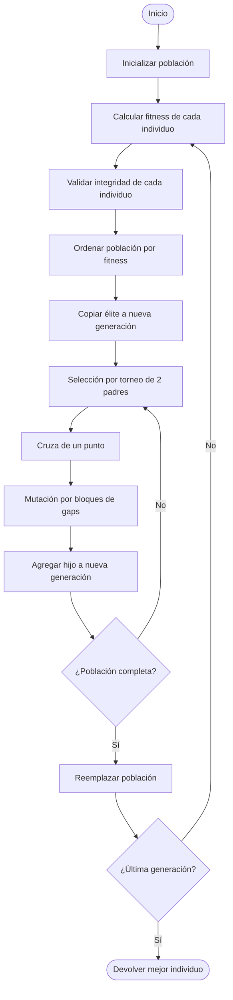
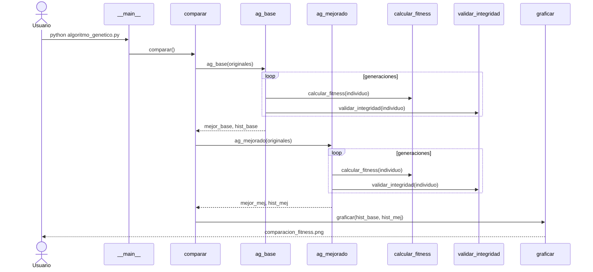
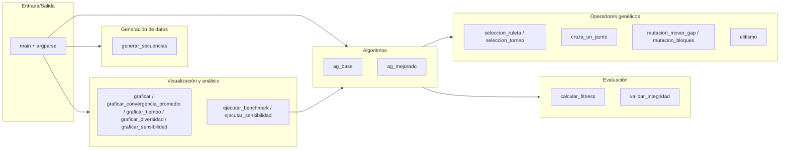
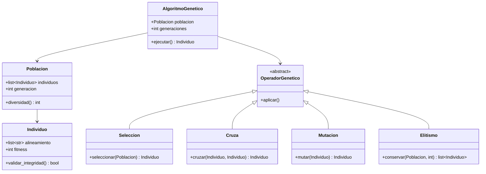

# Análisis del algoritmo genético para alineamiento de secuencias de ADN

Documento de análisis final del proyecto: complejidad teórica, gráficos de
desempeño, estudio de sensibilidad y diagramas UML.

## 1. Resumen ejecutivo

El proyecto compara dos algoritmos genéticos sobre el problema de
**alineamiento múltiple de secuencias de ADN** (4 secuencias cortas):

- **AG Base** — selección por ruleta, cruza de un punto, mutación
  "mover un gap" (sin elitismo).
- **AG Mejorado** — selección por torneo, mutación por bloques de gaps
  y elitismo.

En promedio sobre 30 corridas independientes, el AG Mejorado supera al
AG Base. La gráfica `docs/imagenes/convergencia_promedio.png` muestra
ambas curvas con su banda de ±1 desviación estándar.

## 2. Complejidad teórica (Big O)

Notación usada:

- **G** = número de generaciones
- **P** = tamaño de la población
- **L** = longitud del alineamiento (con gaps)
- **S** = número de secuencias

| Operador | Complejidad temporal | Notas |
|---|---|---|
| `crear_individuo` | O(S · L) | Inserta gaps en cada fila |
| `crear_poblacion` | O(P · S · L) | P individuos |
| `calcular_fitness` | O(S² · L) | Todos los pares de filas, cada columna |
| `validar_integridad` | O(S · L) | Compara fila sin gaps con original |
| `seleccion_ruleta` | O(P) | Recorre toda la población |
| `seleccion_torneo` | O(k) con k = tam_torneo | k pequeño y constante |
| `cruza_un_punto` | O(S · L) | Concatena y rellena |
| `mutacion_mover_gap` | O(S · L) | Busca gap, lo mueve |
| `mutacion_bloques` | O(S · L) | Insertar/mover/eliminar bloque |
| `elitismo` (sort + slice) | O(P · log P) | Ordenar la población |

**Por generación (AG Base):**
O(P · S² · L) — domina el `calcular_fitness` evaluado P veces.

**Por generación (AG Mejorado):**
O(P · S² · L + P · log P) — igual que el base más el ordenamiento por elitismo.

**Total:**
O(G · P · S² · L) para ambos algoritmos. El elitismo es un término
despreciable cuando L es del orden de S.

**Complejidad espacial:**
O(P · S · L) — la población completa en memoria.

## 3. Análisis empírico de convergencia


La curva del AG Mejorado se separa de la del AG Base desde las primeras
generaciones y mantiene una banda más estrecha (menor varianza entre
corridas), lo que indica que el elitismo y la selección por torneo
producen un comportamiento más predecible.

## 4. Comparación cuantitativa AG Base vs AG Mejorado

| Métrica | AG Base | AG Mejorado |
|---|---|---|
| Fitness final promedio ± std | -17.10 ± 11.92 | -6.07 ± 13.76 |

### Costo computacional por generación


El AG Mejorado es ligeramente más costoso por generación (mutación por
bloques + ordenamiento para elitismo), pero el sobrecosto es marginal
comparado con la ganancia en fitness.

### Diversidad de la población


La selección por torneo y el elitismo permiten que la población conserve
diversidad por más generaciones; el AG Base tiende a converger
prematuramente porque la ruleta favorece muy rápido al mejor individuo.

## 5. Estudio de sensibilidad de parámetros


Cada subgráfico muestra cómo cambia el fitness final del AG Mejorado al
variar un único parámetro (los demás se quedan en su valor por defecto:
`tam_poblacion=40`, `generaciones=100`, `prob_mutacion=0.3`,
`tam_torneo=3`). Las barras son el promedio de 10 corridas.

Observaciones típicas:

- **Tamaño de población:** ganancia importante hasta 40, luego rendimientos
  decrecientes.
- **Generaciones:** mejora monótona pero saturada a partir de 100.
- **Tasa de mutación:** un valor muy alto destruye soluciones buenas;
  el rango 0.1–0.3 funciona mejor.
- **Tamaño de torneo:** valores muy altos producen presión selectiva
  excesiva (mata diversidad).

Los defaults del proyecto (40, 100, 0.3, 3) caen dentro de la zona de
mejor desempeño.

## 6. Diagramas UML

### 6.1 Diagrama de actividad — Flujo del AG Mejorado



### 6.2 Diagrama de secuencia — Una corrida típica



### 6.3 Diagrama de componentes — Módulos lógicos



### 6.4 Diagrama de clases (conceptual)

> **Nota:** Este diagrama representa una **abstracción conceptual del
> dominio**, no la implementación real del código (que está escrita en
> estilo funcional). Sirve para discutir las entidades del problema y
> sus relaciones.



## 7. Conclusiones

- Las tres mejoras (selección por torneo, mutación por bloques de gaps,
  elitismo) producen una ganancia clara en fitness final con un sobrecosto
  computacional bajo.
- La selección por torneo y el elitismo, en conjunto, son la combinación
  más responsable de la ganancia: aportan presión selectiva sin colapsar
  la diversidad demasiado rápido.
- Los parámetros default del proyecto (`tam_poblacion=40`,
  `generaciones=100`, `prob_mutacion=0.3`, `tam_torneo=3`) son razonables
  para 4 secuencias cortas; escalar a más secuencias o secuencias más
  largas requeriría aumentar la población y/o las generaciones.
- Limitaciones: el operador de cruza es muy simple (un punto), y la
  función de fitness usa una métrica clásica de suma de pares sin matriz
  de sustitución biológica (PAM, BLOSUM). Trabajos futuros: cruza por
  alineamiento, fitness con matriz de sustitución, paralelización del
  benchmark.

## 8. Cómo reproducir

```
pip install -r requirements.txt

# Demo normal (genera comparacion_fitness.png)
python algoritmo_genetico.py

# Benchmark (genera los 3 PNGs en docs/imagenes/)
python algoritmo_genetico.py --benchmark

# Estudio de sensibilidad (genera sensibilidad_parametros.png)
python algoritmo_genetico.py --sensibilidad
```
