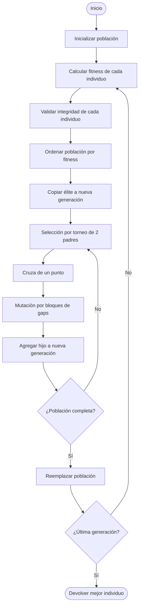
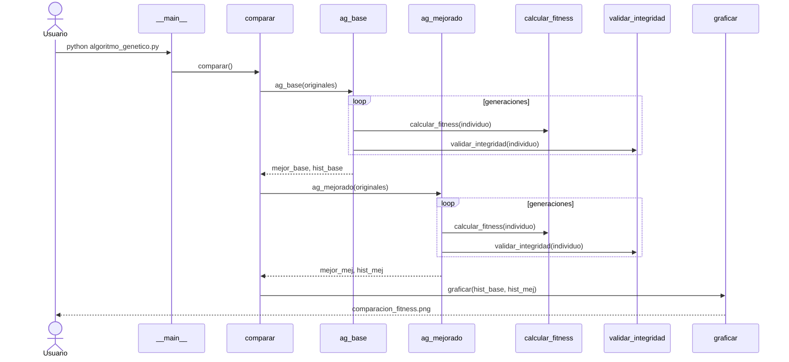
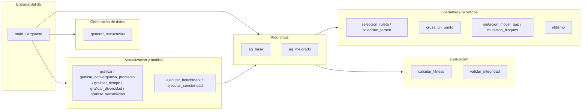
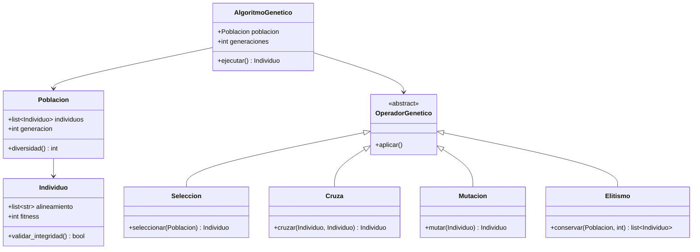

# Diagramas UML

Cuatro diagramas UML del proyecto (en formato **Mermaid**, renderizado
nativamente por GitHub al abrir este archivo en el navegador).

Documento complementario de [`ANALISIS.md`](ANALISIS.md). Para el análisis
del algoritmo ver [`ANALISIS_ALGORITMO.md`](ANALISIS_ALGORITMO.md); para
los gráficos de desempeño ver [`GRAFICOS_DESEMPENO.md`](GRAFICOS_DESEMPENO.md).

## 1. Diagrama de actividad — Flujo del AG Mejorado

Muestra el flujo de control de una corrida completa del AG Mejorado: la
inicialización, el bucle por generación con sus dos lazos anidados
(reproducción hasta completar la población, y avance hasta la última
generación), y los puntos de decisión.

## 2. Diagrama de secuencia — Una corrida típica

Muestra las llamadas entre módulos cuando el usuario ejecuta el modo demo
(`python algoritmo_genetico.py` sin flags): `__main__` invoca a
`comparar`, que ejecuta ambos algoritmos uno tras otro y delega el
graficado final a `graficar`.

## 3. Diagrama de componentes — Módulos lógicos

Aunque el código está en un solo archivo, agrupar las funciones por
responsabilidad clarifica el diseño: entrada/salida, datos, operadores
genéticos, evaluación, algoritmos y visualización.

## 4. Diagrama de clases (conceptual)

> **Nota:** Este diagrama representa una **abstracción conceptual del
> dominio**, no la implementación real del código (que está escrita en
> estilo funcional, sin clases). Sirve para discutir las entidades del
> problema y sus relaciones tal como un diseño orientado a objetos las
> organizaría.

