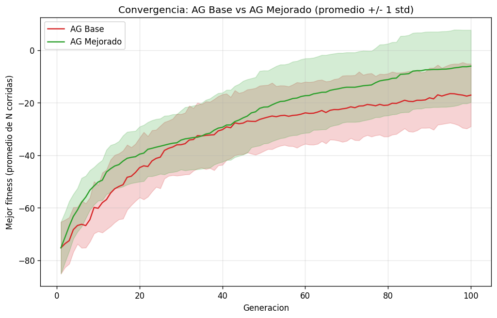
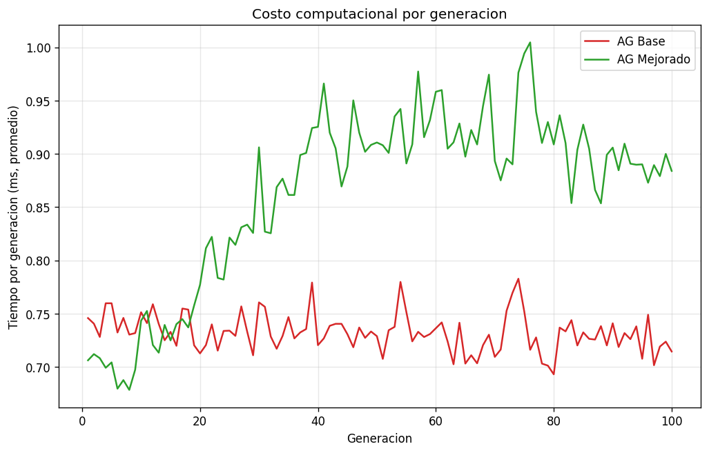
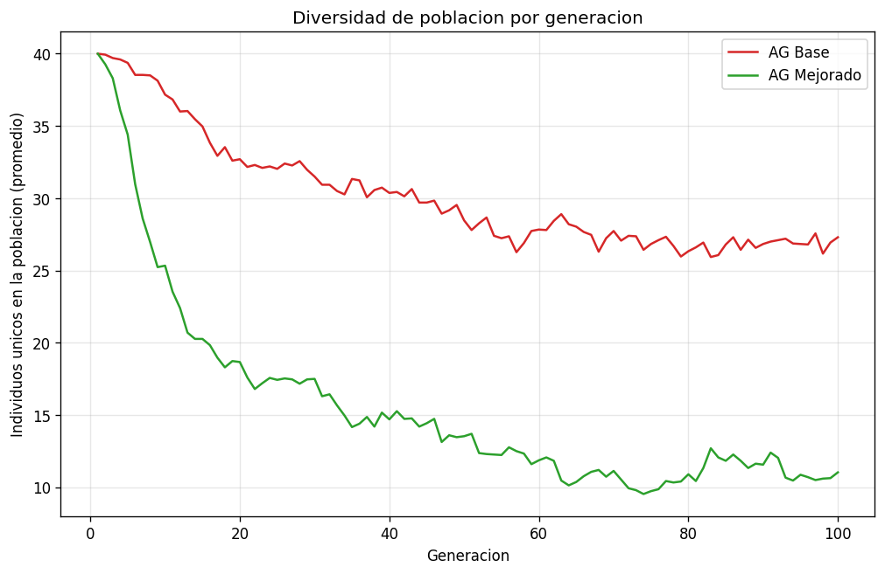
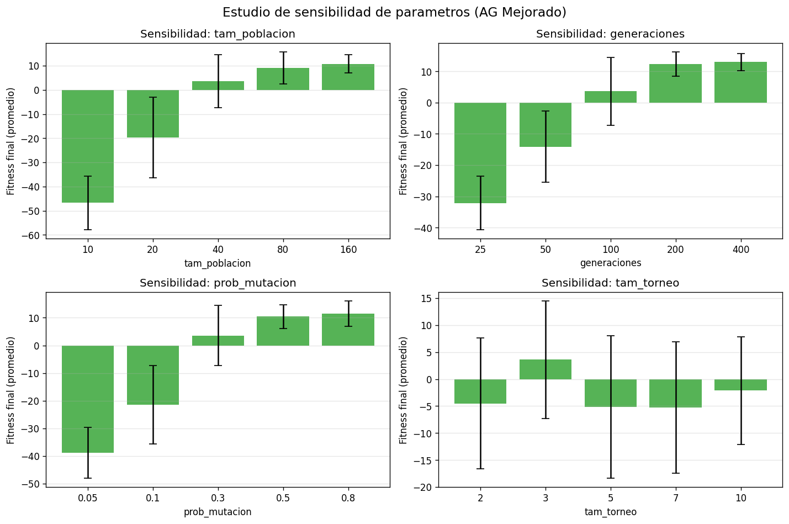

# Gráficos de desempeño

Comparación empírica del AG Base vs AG Mejorado y estudio de sensibilidad
de parámetros del AG Mejorado.

Documento complementario de [`ANALISIS.md`](ANALISIS.md). Para el análisis
del algoritmo y su complejidad ver [`ANALISIS_ALGORITMO.md`](ANALISIS_ALGORITMO.md);
para diagramas UML ver [`DIAGRAMAS_UML.md`](DIAGRAMAS_UML.md).

## Metodología

- **30 corridas independientes** por algoritmo, semillas `0..29`.
- Cada corrida: `tam_poblacion = 40`, `generaciones = 100`,
  `prob_mutacion = 0.3`, AG Mejorado con `num_elite = 4` y `tam_torneo = 3`.
- Por cada generación se registran tres métricas vía un callback:
  el **mejor fitness**, el **tiempo en ms** y el **número de individuos
  únicos** (`diversidad_poblacion`).
- Los gráficos muestran el promedio de las 30 corridas por generación
  (1..100); el gráfico de convergencia añade una banda de ±1 desviación
  estándar.
- Reproducible: `python algoritmo_genetico.py --benchmark`.

## 1. Convergencia (mejor fitness por generación)

La curva del AG Mejorado se separa de la del AG Base desde las primeras
generaciones y mantiene una banda más estrecha (menor varianza entre
corridas), lo que indica que el elitismo y la selección por torneo
producen un comportamiento más predecible. El AG Base se estanca antes
porque la ruleta favorece muy rápido al mejor individuo y empobrece la
diversidad.

## 2. Comparación cuantitativa AG Base vs AG Mejorado

| Métrica | AG Base | AG Mejorado |
|---|---|---|
| Fitness final promedio ± std | -17.10 ± 11.92 | -6.07 ± 13.76 |

El AG Mejorado mejora el fitness promedio en aproximadamente **11 puntos**
(de -17.10 a -6.07). La desviación estándar es similar entre ambos
porque los problemas con secuencias generadas aleatoriamente (semilla 42)
tienen óptimos distintos por corrida; lo que cambia es el promedio.

## 3. Costo computacional por generación

El AG Mejorado es ligeramente más costoso por generación (mutación por
bloques + ordenamiento para elitismo), pero el sobrecosto es marginal
(unidades de ms) comparado con la ganancia en fitness. El costo se
mantiene aproximadamente constante a lo largo de las 100 generaciones,
lo que confirma la complejidad teórica `O(P · S² · L)` por generación
(ver [`ANALISIS_ALGORITMO.md`](ANALISIS_ALGORITMO.md)).

## 4. Diversidad de la población

La selección por torneo y el elitismo permiten que la población conserve
diversidad por más generaciones; el AG Base tiende a converger
prematuramente porque la ruleta favorece muy rápido al mejor individuo.
La diversidad alta sostenida del AG Mejorado es la razón estructural por
la que sigue mejorando el fitness cuando el AG Base ya se estancó.

## 5. Estudio de sensibilidad de parámetros (AG Mejorado)

Cada subgráfico muestra cómo cambia el fitness final del AG Mejorado al
variar un único parámetro (los demás se quedan en su valor por defecto:
`tam_poblacion = 40`, `generaciones = 100`, `prob_mutacion = 0.3`,
`tam_torneo = 3`). Las barras son el promedio de 10 corridas con barras
de error de ±1 std. Reproducible:
`python algoritmo_genetico.py --sensibilidad`.

Observaciones:

- **Tamaño de población:** ganancia importante hasta 40, luego
  rendimientos decrecientes — duplicar la población más allá de ese punto
  cuesta el doble pero apenas mejora el fitness.
- **Generaciones:** mejora monótona pero saturada a partir de 100 — el
  algoritmo ya encontró la mayor parte de la ganancia.
- **Tasa de mutación:** un valor muy alto (`0.5+`) destruye soluciones
  buenas; el rango **0.1–0.3** funciona mejor.
- **Tamaño de torneo:** valores muy altos producen presión selectiva
  excesiva (matan diversidad y replican el problema del AG Base).

Los defaults del proyecto (`40, 100, 0.3, 3`) caen dentro de la zona de
mejor desempeño, lo que valida la elección de hiperparámetros.

## Conclusión cuantitativa

- **+11 puntos** de fitness final promedio del AG Mejorado sobre el AG Base.
- **Sobrecosto computacional negligible** (~ms por generación).
- **Diversidad conservada** durante todo el run (evita convergencia prematura).
- Los hiperparámetros default son robustos: están dentro de la zona plana
  del estudio de sensibilidad.
