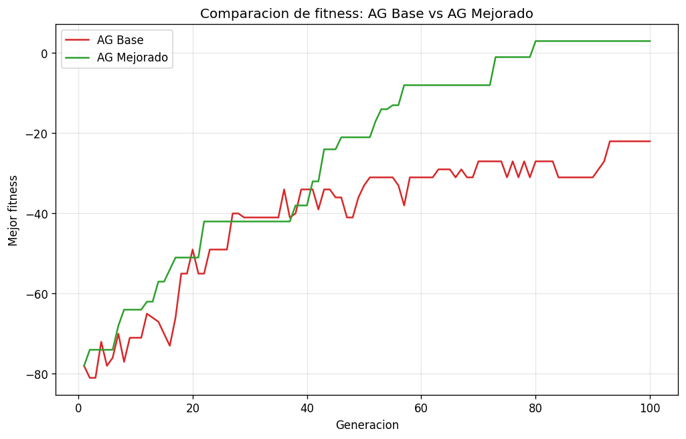

# Algoritmo Genético para Alineamiento de Secuencias de ADN

Implementación de un algoritmo genético en dos versiones —**base** y
**mejorada**— para resolver el problema de **alineamiento múltiple de
secuencias de ADN**, con una gráfica que compara el fitness de ambas.

## ¿Qué es un algoritmo genético?

Un algoritmo genético imita la evolución natural. Parte de una *población*
de soluciones candidatas, evalúa su *fitness* (qué tan buena es cada una) y
genera nuevas generaciones mediante **selección** (elegir los mejores como
padres), **cruza** (combinar dos padres) y **mutación** (cambios aleatorios
pequeños). Generación tras generación, el fitness tiende a mejorar.

## El problema: alineamiento de secuencias

Cada *individuo* es un alineamiento de 4 secuencias de ADN cortas con gaps
(`-`) insertados. El **fitness** usa la suma de pares: por cada par de filas
y cada columna suma +1 si coinciden, -1 si difieren y -2 si una es gap.

## Validación de integridad

La cruza y la mutación **solo insertan, mueven o borran gaps**; nunca
alteran ni reordenan las letras A/C/G/T. La función `validar_integridad`
comprueba en cada generación que, al quitar los gaps de cada fila, se
recupera exactamente la secuencia original.

## Las 3 mejoras del algoritmo mejorado

1. **Selección por torneo:** en vez de ruleta; toma varios individuos al
   azar y elige el de mayor fitness (mejor presión selectiva).
2. **Mutación por bloques de gaps:** en vez de mover un solo gap, inserta
   un bloque, mueve un bloque o elimina columnas de solo gaps.
3. **Elitismo:** los mejores individuos pasan intactos a la siguiente
   generación, así nunca se pierde la mejor solución.

## Cómo ejecutar

```
pip install -r requirements.txt
python algoritmo_genetico.py
```

El programa imprime las secuencias, los resultados de ambos algoritmos y la
comparación de fitness; además genera `comparacion_fitness.png` y la abre en
el visor de imágenes del sistema.

## Resultados



## Video de demostración

🎥 Link del video: _PENDIENTE_

## Repositorio

🔗 Link de GitHub: https://github.com/GaelSandovalv/algoritmo-genetico-mejora

## Fuentes

- Genetic algorithm — Wikipedia: https://en.wikipedia.org/wiki/Genetic_algorithm
- Naturally selecting solutions: genetic algorithms in bioinformatics — PMC:
  https://pmc.ncbi.nlm.nih.gov/articles/PMC3813526/
- SAGA: Sequence Alignment by Genetic Algorithm — Nucleic Acids Research:
  https://academic.oup.com/nar/article/24/8/1515/2359898
